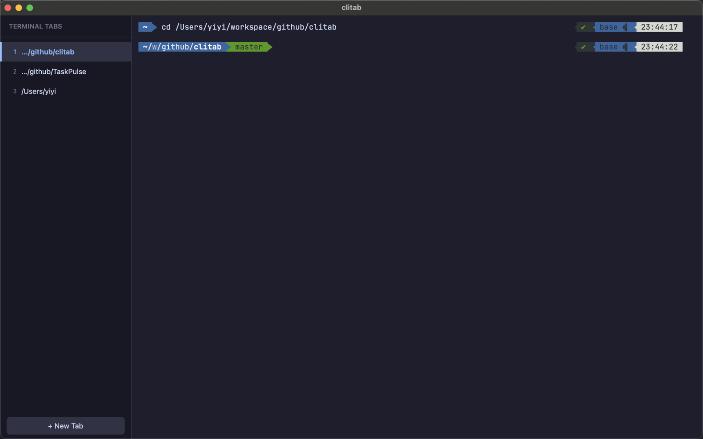
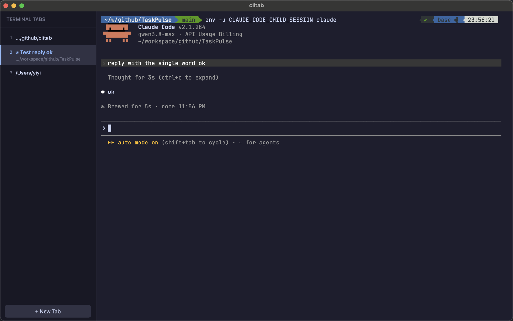
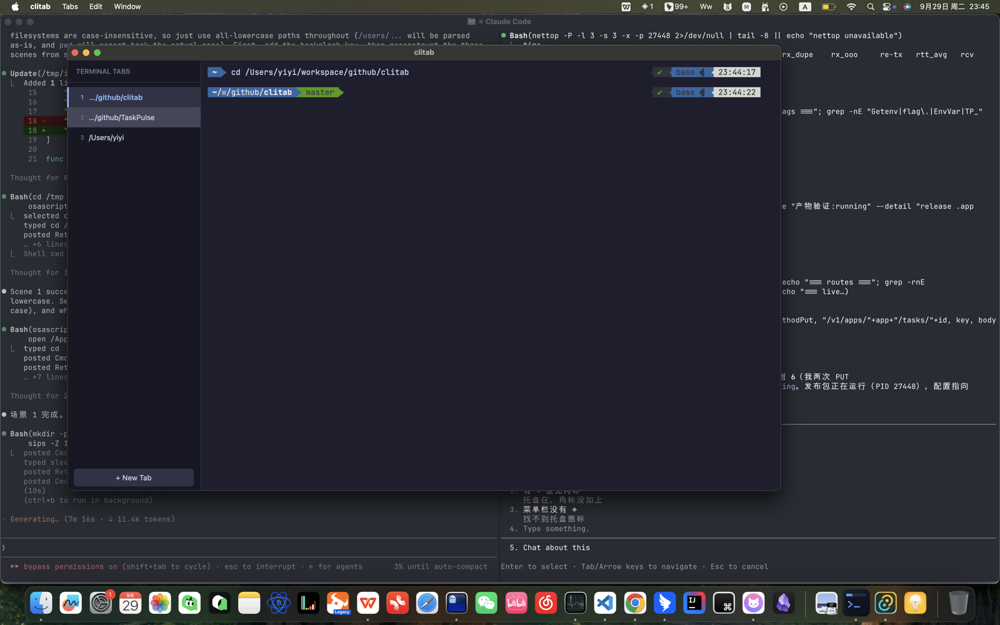

# clitab

[中文 README](README.zh-CN.md)

A tabbed terminal built for Claude Code sessions: every tab is a real PTY
running your shell, named after its working directory — or after the session,
once Claude Code gives it a title. Tabs flash when Claude Code needs your
attention, so a row of parallel agents stays glanceable.

Built with [Tauri 2](https://tauri.app) (Rust + portable-pty) and
[xterm.js](https://xtermjs.org).

## Screenshots



Every tab is a real shell named after its working directory — three
projects side by side in one window.



Run `claude` in any tab: while the session runs, the tab switches from
the directory to the session's own title, and reverts when the turn ends.



When a session needs you, its tab flashes (BEL / OSC 9) — a row of
parallel agents stays glanceable from whichever tab you are in.

## Features

- **Real PTY tabs** — each tab spawns your `$SHELL` through a per-tab
  pseudo-terminal; tabs stay alive while hidden and keep their size. A new tab
  opens in the current tab's working directory.
- **Open from Finder** — right-click a folder in Finder and choose
  Services → "New clitab Tab Here" to open a tab in that directory. Works on
  files (opens the containing folder) and on the Finder window background
  (opens the window's folder), whether or not clitab is running.
- **Automatic tab names** — the title is the working directory (reported by a
  shell-integration hook on every prompt), and switches to the session name
  when Claude Code sets a terminal title. It reverts to the directory when the
  assistant's turn ends.
- **Attention flash** — a tab flashes when Claude Code asks for input or sends
  a notification (BEL / OSC 9). See [CLAUDE_HOOKS.md](CLAUDE_HOOKS.md) for the
  one-time hook setup.
- **Desktop-grade shortcuts** — a native menu drives ⌘T / ⌘W / ⌃Tab / ⌘1–9,
  so they work even when the terminal does not have keyboard focus. Closing a
  tab with a running process asks first.
- **Click a tab, type immediately** — activating a tab moves the caret into
  its terminal; no second click needed.
- **Survives window reloads** — the most recent 256 KB of each tab's output is
  kept in a ring buffer and replayed on re-attach. Repaint-style TUI output
  (Claude Code, vim, …) gets a clean start instead of a ghosted replay.
- **Shell integration without typing into your terminal** — bash gets a
  `--rcfile` wrapper, zsh a `ZDOTDIR` wrapper that links your own startup
  files, so your config loads untouched. Per-tab files live in `$TMPDIR` and
  are removed with the session.
- 5000-line scrollback, ⌘C/⌘V/⌘A copy-paste, trackpad tap-to-drag does not
  accidentally select text.

## Install (macOS)

Download the `.dmg` for your chip from [Releases](../../releases) —
`aarch64` for Apple Silicon (M1–M4), `x64` for Intel — and drag **clitab**
into Applications.

Release builds are ad-hoc signed but **not notarized**, and downloaded
files carry the quarantine attribute, so on a fresh download macOS
Gatekeeper intervenes twice — once for the `.dmg`, once for the app.
Both are one-time **Open Anyway** clicks:

1. Double-click the `.dmg`; macOS refuses with a dialog saying the file
   "cannot be opened" / does not have permission to open it. Click
   **OK**.
2. Open **System Settings → Privacy & Security** and scroll to the
   **Security** section: "*clitab_0.1.0_….dmg* was blocked to protect
   your Mac" with an **Open Anyway** button. Click it and confirm with
   your password (or Touch ID); the disk image then mounts normally.
3. Drag **clitab** into Applications. The first time you open it, the
   app itself is blocked the same way: back in **Privacy & Security**,
   click **Open Anyway** next to "*clitab* was blocked…". One-time —
   later launches open normally.

Terminal shortcut (skips both prompts): clear the quarantine flag on the
downloaded `.dmg` *before* opening it; apps copied from it then inherit
nothing:

```bash
xattr -d com.apple.quarantine ~/Downloads/clitab_0.1.0_*.dmg
```

(On macOS 15 Sequoia and later, right-click → Open no longer bypasses
Gatekeeper for a signature like this one — use **Open Anyway** above.)

Building from source (`npm run package:macos`) needs no such step: the
bundle is ad-hoc signed and never quarantined, so it opens directly.

Both builds are native; nothing needs Rosetta.

## Claude Code integration

Run `claude` in any tab like you would in a normal terminal — clitab picks up
the session title from the escape sequences Claude Code already emits.

For the attention flash, add a Notification hook to your Claude Code settings
(`~/.claude/settings.json`) that rings the bell:

```json
{
  "hooks": {
    "Notification": [
      {
        "matcher": ".*",
        "hooks": [{ "type": "command", "command": "printf '\\a'" }]
      }
    ]
  }
}
```

Details and troubleshooting: [CLAUDE_HOOKS.md](CLAUDE_HOOKS.md).

## Shortcuts

Defined in the native menu (`src-tauri/src/menu.rs`), so they work even when
the terminal does not have keyboard focus.

| Key | Action |
| --- | --- |
| `⌘T` | New tab |
| `⌘W` | Close tab (asks first if a process is still running) |
| `⌃Tab` / `⌃⇧Tab` | Next / previous tab |
| `⌘1` … `⌘8` | Jump to tab 1–8 |
| `⌘9` | Jump to the last tab |
| `⌘C` / `⌘V` / `⌘A` | Copy / paste / select all |

In the tab list, arrow keys / Home / End move between tabs.

## Development

```bash
npm install
npm run tauri dev     # vite + tauri dev build
npm run dev:log       # the same, tee'd to /tmp/clitab-dev.log for reporting
npm run tauri build   # release bundle
```

Checks and tests:

```bash
npm run typecheck   # tsc --noEmit
npm run build       # typecheck + vite build
npm test            # cargo test --lib: OSC parser, registry, shell integration
```

## Security

- **CSP** is configured in `tauri.conf.json`. It only reaches the *bundled*
  app: in dev the page is served by Vite, and Tauri applies the policy to the
  assets it embeds itself. Two entries are load-bearing —
  `connect-src ipc: http://ipc.localhost` is how `invoke()` and events reach
  Rust, and `style-src 'unsafe-inline'` is required because xterm.js builds
  `<style>` elements at runtime. If IPC stops working, check the first one.
- **Shell integration files** go to a per-tab directory under `$TMPDIR`
  (`clitab-<tab-id>`), never a fixed shared path, and are deleted with the
  session.
- **Capabilities** live in `src-tauri/capabilities/default.json`; the `windows`
  list there must match `app.windows[].label` in the config.

## License

MIT — see [LICENSE](LICENSE).
