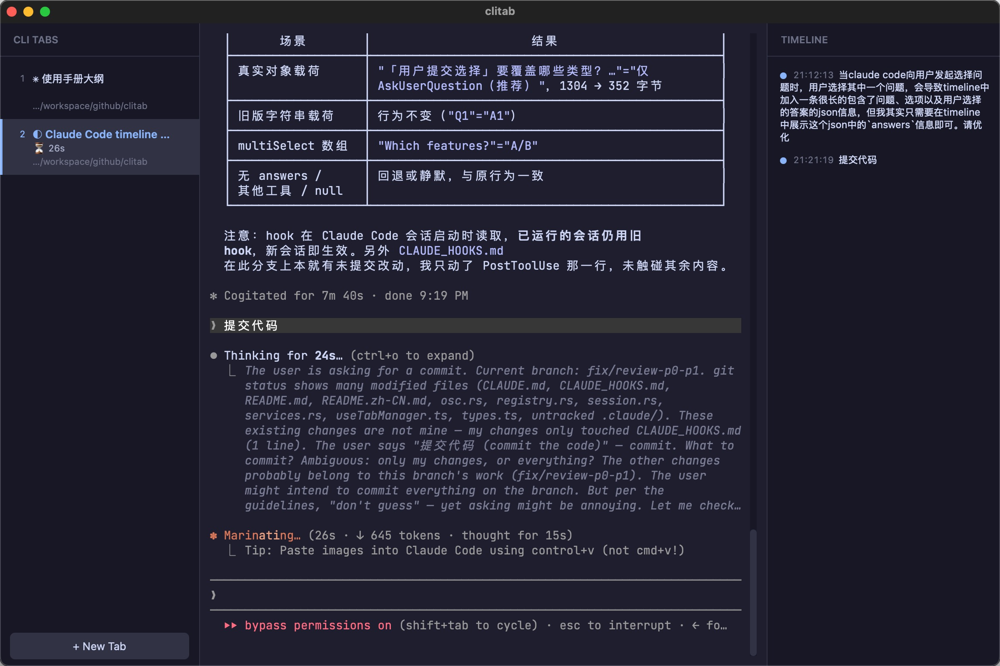

# clitab

[中文 README](README.zh-CN.md) · 📖 [User Manual (Wiki)](https://github.com/dongritengfei/clitab/wiki/Manual)

A tabbed terminal built for agent CLI sessions (Claude Code, Qoder CLI):
every tab is a real PTY running your shell, named after its working directory
— or after the session, once the agent gives it a title. Tabs flash when a
session needs your attention, so a row of parallel agents stays glanceable.

Built with [Tauri 2](https://tauri.app) (Rust + portable-pty) and
[xterm.js](https://xtermjs.org).

## Screenshots



The tab list (left) names every tab after its working directory or its agent
session, with a live timer while a turn runs; the session itself runs in
the middle; the timeline panel (right) logs what you sent.

## Features

- **Real PTY tabs** named after their working directory — or after the
  agent session (Claude Code, Qoder CLI) running in them.
- **Attention flash and triage** — flashing tabs, a Dock badge, `⌘J` and
  macOS notifications pointing you at the sessions waiting on you.
- **Tab dashboard and session timeline** — live tool timer, turn duration
  and a log of what you sent, via the optional agent hooks.
- **Open from Finder** — Services → "New clitab Tab Here".
- **Terminal search, desktop-grade shortcuts, 5000-line scrollback.**

How each of these works is covered in the
[User Manual](https://github.com/dongritengfei/clitab/wiki/Manual).

## Install (macOS)

Download the `.dmg` for your chip from [Releases](../../releases) —
`aarch64` for Apple Silicon (M1–M4), `x64` for Intel — and drag **clitab**
into Applications. Release builds are ad-hoc signed but **not notarized**,
so a fresh download trips macOS Gatekeeper twice; the
[User Manual](https://github.com/dongritengfei/clitab/wiki/Manual#2-installation-and-first-launch)
walks through both one-time **Open Anyway** clicks.

## Agent integration

Run `claude` or `qodercli` in any tab like you would in a normal terminal —
clitab picks up the session title from the escape sequences the agent already
emits.

The attention flash, the tab dashboard and the session timeline are powered by
agent hooks: the
[User Manual](https://github.com/dongritengfei/clitab/wiki/Manual#what-the-hooks-add)
has a copy-paste prompt that sets up the Claude Code side, and
[AGENT_HOOKS.md](AGENT_HOOKS.md) carries both configs (Claude Code and Qoder
CLI) plus the protocol details.

## Shortcuts

`⌘T` / `⌘W` / `⌃Tab` / `⌘J` / `⌘1–9` / `⌘F` / `⌘C` / `⌘V` / `⌘A` — the
full table, and why they work even without terminal focus, is in the
[User Manual](https://github.com/dongritengfei/clitab/wiki/Manual#11-keyboard-shortcuts).

## Development

```bash
npm install
npm run tauri dev     # vite + tauri dev build
npm run dev:log       # the same, tee'd to /tmp/clitab-dev.log for reporting
npm run tauri build   # release bundle
```

Checks and tests:

```bash
npm run typecheck   # tsc --noEmit
npm run build       # typecheck + vite build
npm test            # cargo test --lib: OSC parser, registry, shell integration
```

## License

MIT — see [LICENSE](LICENSE).
